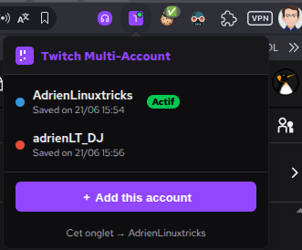

# twitch-multi-accounts

Une extension de navigateur pour Vivaldi (et n'importe quel navigateur basé sur Chromium) permettant d'utiliser plusieurs comptes Twitch simultanément dans la même fenêtre.

---

Je gère deux comptes Twitch dans le cadre de mon installation de streaming DJ :

- **adrienLinuxtricks** — mon compte principal
- **adrienLT_DJ** — mon compte dédié aux streams DJ

**Twitch ne gère pas le multi-compte de manière native.** Il n'existe aucun moyen intégré d'être connecté à deux comptes en même temps au cours d'une même session de navigation. Changer de compte implique de se déconnecter et de se reconnecter à chaque fois, ce qui n'est pas viable lorsqu'on doit gérer les deux comptes pendant un live.

**Vivaldi (et les navigateurs basés sur Chromium en général) ne peuvent pas isoler les sessions par onglet pour un même site web.** Contrairement à Firefox, qui dispose d'une API native *Multi-Account Containers* (`contextualIdentities`) attribuant des compartiments de cookies distincts à chaque onglet, Chromium partage les cookies globalement sur tous les onglets pour un domaine donné. Il n'existe aucune API d'extension permettant de modifier ce comportement.

Les seules alternatives intégrées — utiliser des profils de navigateur distincts ou des fenêtres de navigation privée — ouvrent toutes deux des fenêtres complètement séparées, ce qui casse la routine de travail sur une seule fenêtre, pourtant essentielle pour gérer efficacement un stream. La fonctionnalité a été demandée à Vivaldi ici : [Multi-Account Containers - Vivaldi Forum](https://forum.vivaldi.net/topic/25289/multi-account-containers)

J'ai donc développé cette extension pour répondre à mes propres besoins.

---

## Comment ça fonctionne

L'extension stocke une **capture des cookies Twitch** pour chaque compte. Lorsqu'on clique sur **Open** (Ouvrir) sur un compte enregistré, elle :

1. Sauvegarde les cookies Twitch actuels dans l'emplacement précédemment actif.
2. Restaure les cookies du compte cible dans le navigateur.
3. Ouvre un nouvel onglet Twitch connecté avec ce compte.

Lorsqu'on passe d'un onglet Twitch assigné à un autre, l'échange de cookies se fait automatiquement et l'onglet se recharge.

> **Note :** Étant donné que Chromium partage les cookies entre tous les onglets d'un même domaine, deux onglets ne peuvent pas être actifs en même temps avec des sessions différentes. La bonne session est chargée dès que tu mets l'onglet concerné au premier plan.

---

## Installation

1. Extraire l'archive ZIP.
2. Ouvrir `vivaldi://extensions` (ou `chrome://extensions`).
3. Activer le **Mode développeur**.
4. Cliquer sur **Charger l'extension non empaquetée** et sélectionne le dossier `twitch-multi-accounts/`.

---

## Utilisation

### Configuration initiale

**Compte A (ex: adrienLinuxtricks) :**
1. Va sur [twitch.tv](https://www.twitch.tv) et connecte-toi avec le compte A.
2. Ouvre le popup de l'extension → clique sur **＋ Add this account** (Ajouter ce compte) → donne-lui un nom → Enregistre.
   *(tes cookies actuels sont capturés et stockés)*

**Compte B (ex: adrienLT_DJ) :**
1. Dans le popup, clique sur **Open** sur le compte A — cela charge ses cookies dans un nouvel onglet.
2. Déconnecte-toi de Twitch, puis connecte-toi avec le compte B.
3. Ouvre le popup → **＋ Add this account** → donne-lui un nom → Enregistre.

Tu as maintenant deux emplacements sauvegardés. Clique sur **Open** sur l'un ou l'autre pour ouvrir un onglet Twitch avec la bonne session.

### Utilisation quotidienne

- Clique sur **Open** à côté d'un compte pour ouvrir un nouvel onglet Twitch pour ce compte.
- Navigue entre les onglets normalement — les cookies sont échangés automatiquement lorsque l'onglet passe au premier plan.
- Clique sur ✎ pour renommer un compte ou changer sa couleur.
- Le badge **Active** indique quel compte est actuellement attribué à l'onglet en cours.

---

## Limitations

- **Les cookies sont partagés dans Chromium** — deux onglets ne peuvent pas contenir des sessions Twitch différentes simultanément. L'échange (swap) s'effectue à l'activation de l'onglet.
- Fonctionne uniquement sur `twitch.tv` — volontairement restreint à ce domaine.
- Si Twitch modifie sa méthode d'authentification (par exemple, en passant des cookies à un autre mécanisme), l'extension devra potentiellement être mise à jour.

---

## Licence

Projet personnel — aucune licence, aucune garantie. À utiliser à tes propres risques.
